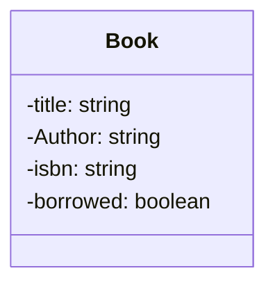

# Library Api
Uma api que simula um sistema de empréstimo de livros de uma livraria

[Preview](https://library-api-oliyan.up.railway.app/swagger-ui/index.html)

## Diagrama de Classe

```mermaid
classDiagram

  class Book {
    -title: string
    -Author: string
    -isbn: string
    -borrowed: boolean
  }

```
