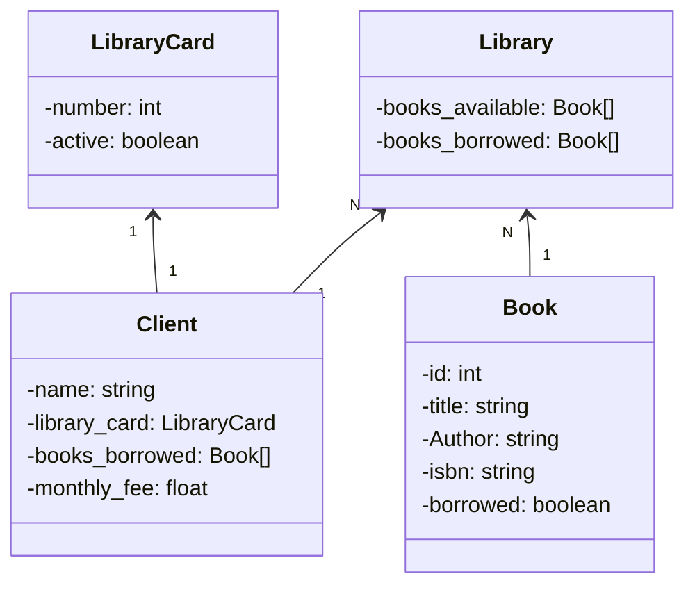

# Library Api
Uma api que simula um sistema de empréstimo de livros de uma livraria

## Diagrama de Classes

```mermaid
classDiagram
  class Library {
    -books_available: Book[]
    -books_borrowed: Book[]
  }
  
  class Client {
    -name: string
    -library_card: LibraryCard
    -books_borrowed: Book[]
    -monthly_fee: float
  }

  class Book {
    -id: int
    -title: string
    -Author: string
    -isbn: string
    -borrowed: boolean
  }

  class LibraryCard {
    -number: int
    -active: boolean
  }

  Library "N" <-- "1" Client
  Library "N" <-- "1" Book
  LibraryCard "1" <-- "1" Client
```
